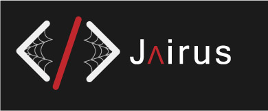

# Final Integrated Project

This website will showcase my experiences and what I've learned so far in the first semester of Interactive Media Design program. While also explaining my plans for this website throughout college and career path after Fanshawe.

### Getting Started
This is a basic HTML and CSS build. for more information about these, go to: [Mozilla Developer Network](https://developer.mozilla.org/en-US/docs/Learn)

To gain access to this project, clone the repo to the location of your choice, and open with your choice of editor.

### Prerequisites
An editor and Git

## Author
+ Jairus Vialu - *Planning, Development, Design*

## License
This project is licensed under MIT licence.

